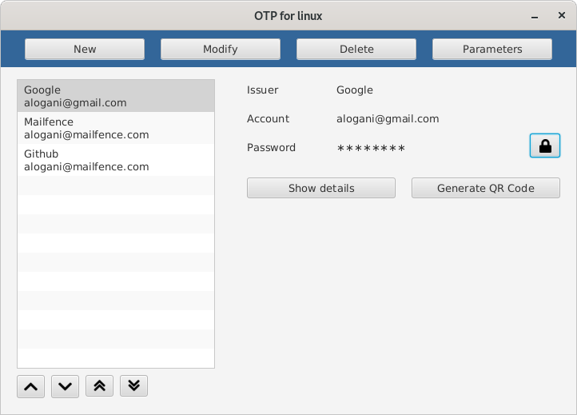

# __ OTP for linux

OTP for linux is an open-source desktop client to manage your one-time passwords (OTP).

## How one-time passwords works ?

A lot of websites and servers offers two-factor authentification, this way you will reinforce your login security.
It is utterly difficult for someone who intercepts a one-time password to decipher the secret key associated.
So even if your crendentials have been intercepted by a man-in-the-middle attack or by phishing, you will make the hacker job hard.

This application is a client. This means a server (like a website) will provide you a secret key. And with this secret key, your OTP application will generate unique and changing passwords to submit to the server. As the server will also generate a password from the same secret key and specifics, the passwords will match and you will be authentificated with good confidence.

For more details, see : https://searchsecurity.techtarget.com/definition/one-time-password-OTP

## How does this application works ?

This applications is made to be simple and intuitive.

If you want to enter a OTP entry manually (from your your OTP phone app entry), just click on new and enter the details.

If a website provides you a QRCode to scan. Just right-click on it, save it in your filesystem, and then you can easily import the QRCode in a few clicks into your application (new -> import from QRCodes -> choose the file).

Please always verify the password generated by your application is correct.

With this application, you will be able to :
 * Handle Time-based One-Time Password (TOTP) and HMAC-based One-Time Password (HOTP)
 * Generate QRCodes that can be scanned on with an android or ios OTP application.
 * Import QRCodes
 
## How to install it ?

If you are on a debian-based system (like ubuntu or linux mint) :
1. Download the last [deb package](https://github.com/Alogani/otplinux/releases) (under Assets)
2. Install it via
    * a GUI tool like gdebi
    * or the command-line : `sudo apt install path_to_deb_file.deb`

On another linux system, you can run it by :
1. Downloading the [jar file](https://github.com/Alogani/otplinux/releases) (under Assets)
2. Running the program with the command `java -jar path_to_jar_file.jar`.
_You will need a java 11 runtime (like openjdk-11-jre)_

## Why did I made this application ?

I use two-factor authentification when I login to websites in which security seems critically important for me, like my mail account or my Paypal account. I already use the very good and open-source freeotp-android on my phone (I have absolutly no link with this project).
But when my phone will die and if I haven't made proper backups, all my info will be lost, and I might probably lose for good my access to my mail account.

I've found no OTP GUI application for linux and because I've been really wanting to create my first own program and learn the Java language (as I want to make career as a developper), I decided to create it. And I really hope this application will be useful for you.

## Coming features

If this application is used and appreciated, the following improvements may be implemented :
* French and german language
* The possibility to encrypt the datafiles where the token are stored
* More constraints on the allowed token parameters to comply to standards (RFC4226 and RFC6238 memos)
* Provide eventually MD5 support (although it is less secure)
* For v2, a windows and a mac installer
